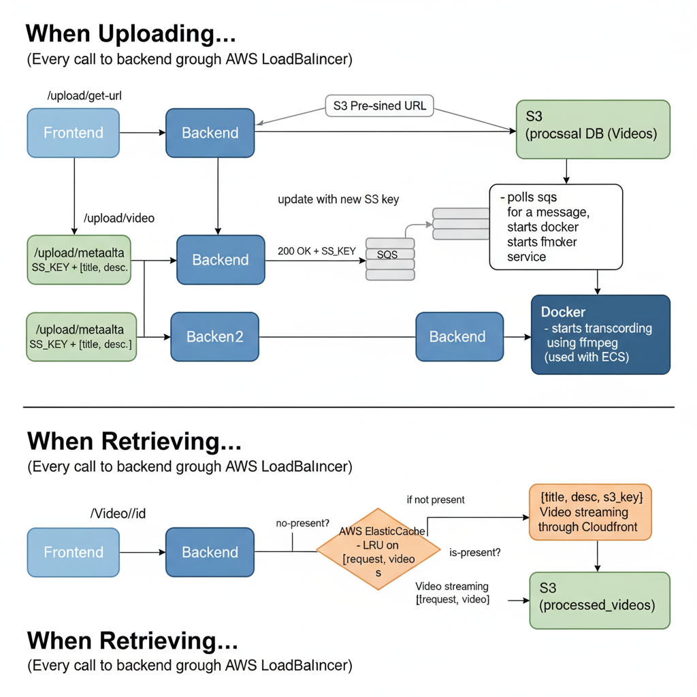

# Video Streaming App Tutorial

Lightweight video streaming tutorial project demonstrating a mobile Flutter client, a Python backend, a transcoder worker and a consumer service. The system uses S3 for storage, SQS for job messaging and Redis for caching/session support.

Summary
- Frontend: Flutter mobile app (flutter_client/)
- Backend API: Python FastAPI services (backend/)
- Transcoder: Python worker that runs ffmpeg (transcoder/)
- Consumer: Python service to consume processed messages (consumer/)
- Infrastructure: S3 for videos, SQS for job queue, Redis/Elasticache for caching

Where to put the architecture image
- Place the architecture image at the repository root as `architecture.png` (or update the path above if you prefer `docs/architecture.png`).

Quick start (development)
1. Inspect each service folder for an `.env.example` and create `.env` files.
2. Each Python service uses `requirements.txt`. Create a venv and install:
   - python -m venv .venv
   - source .venv/bin/activate
   - pip install -r requirements.txt
3. Run services individually from their folders (e.g. `backend/main.py`, `transcoder/main.py`, `consumer/main.py`) or use docker/docker-compose where provided.

Project layout
- backend/ — API, DB models, routes
- flutter_client/ — Flutter mobile app
- transcoder/ — Video processing worker
- consumer/ — Consumer worker (SQS processing or similar)

Notes
- Add `architecture.png` to the repo root for the image to render above.
- See each service README or `main.py` for service-specific run instructions.

Technologies used: AWS, FastAPI, Redis, Docker, Flutter, PostgreSQL, Bloc
