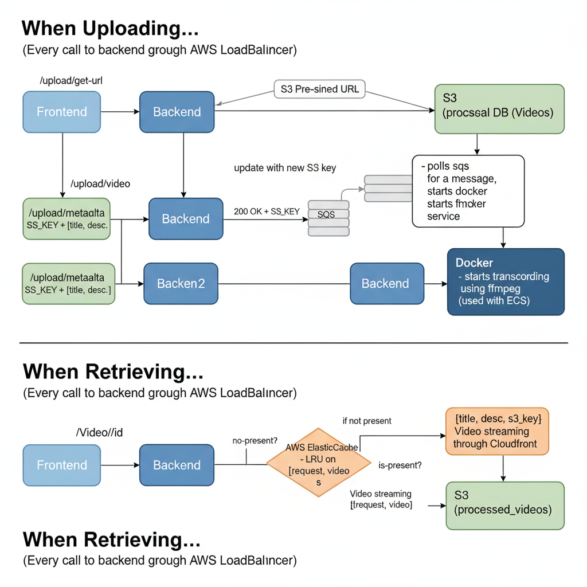

# Video Streaming App Tutorial

Lightweight, production-oriented video streaming example demonstrating a Flutter mobile client, Python FastAPI backend, a transcoding worker, and a consumer worker. The architecture uses AWS S3 for storage, SQS for job messaging, and Redis for caching/sessions.

## Project layout

- backend/ — API, DB models, routes ([backend/main.py](backend/main.py))
- transcoder/ — Video processing worker ([transcoder/main.py](transcoder/main.py))
- consumer/ — Job consumer worker ([consumer/main.py](consumer/main.py))
- flutter_client/ — Flutter mobile application and client logic ([flutter_client/README.md](flutter_client/README.md))
- architecture.png — High-level system diagram

## Technologies

- Frontend: Flutter + BLoC / Cubits (see [`UploadVideoCubit`](flutter_client/lib/cubits/upload_video/upload_video_cubit.dart))
- Backend: FastAPI (Python)
- Workers: Python + ffmpeg for transcoding
- Infrastructure: AWS S3, SQS, Redis, PostgreSQL (or local DB)
- Containerization: Docker / docker-compose (when provided per service)

## Quickstart (development)

1. Copy environment files:
   - backend: copy `backend/.env.example` -> `backend/.env`
   - transcoder: copy `transcoder/.env.example` -> `transcoder/.env`
   - consumer: copy `consumer/.env.example` -> `consumer/.env`
   - flutter: configure any required keys in `flutter_client/.env` as needed

2. Python services (backend, transcoder, consumer)
   - Create and activate a virtual environment:
     - `python -m venv .venv && source .venv/bin/activate`
   - Install dependencies:
     - `pip install -r <service>/requirements.txt`
   - Run service entrypoints:
     - `python backend/main.py` — API server
     - `python transcoder/main.py` — Transcoder worker
     - `python consumer/main.py` — Consumer worker

3. Flutter client
   - From `flutter_client/`:
     - `flutter pub get`
     - `flutter run` (or `flutter build apk` / `flutter build ios`)
   - Inspect client configuration and BLoC logic, e.g., video upload flow in [`UploadVideoCubit`](flutter_client/lib/cubits/upload_video/upload_video_cubit.dart)

4. Docker (optional)
   - Use provided Dockerfiles and `docker-compose.yml` in services where available to run containers for local testing.

## Recommended workflow

- Local development: run each service individually for rapid iteration.
- Integration testing: compose services via docker-compose or use local stacks (localstack/minio, local SQS alternatives).
- CI/CD: build and test containers, run static analysis (`flutter analyze`, Python linters), and run unit tests.

## Security & secrets

- Do not commit `.env` files with secrets. Use the `.env.example` templates.
- For AWS credentials, prefer environment variables or the AWS SDK credential providers.

## Contributing

- Follow idiomatic style for each component:
  - Python: type hints, tests, requirements pinned in `requirements.txt`
  - Flutter: follow the `analysis_options.yaml` lints and BLoC patterns
- Open issues and PRs with focused changes and tests where applicable.

## Where to find things

- API entrypoint: [backend/main.py](backend/main.py)
- Transcoder entrypoint: [transcoder/main.py](transcoder/main.py)
- Consumer entrypoint: [consumer/main.py](consumer/main.py)
- Mobile upload logic: [`UploadVideoCubit`](flutter_client/lib/cubits/upload_video/upload_video_cubit.dart)
- Flutter client manifest: [flutter_client/pubspec.yaml](flutter_client/pubspec.yaml)
- Architecture diagram: [architecture.png](architecture.png)

## License

Add your preferred license file (e.g., `LICENSE`) and reference it here.